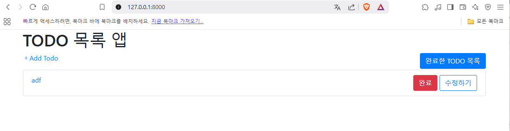

### [Django] 장고 프로젝트 시작 전 초기 환경 설정

1. 도커를 각각에 맞게 설치한다.

2. 아래의 명령어로 requirements.txt 파일을 만든다.
   pip list --format=freeze > requirements.txt (@, file:///를 버전으로 바꾸기)

3. requirements.txt 에러시 적절한 조치를 취한다.
   해당 파일에서 아래의 솔루션은 삭제한다.

-   pywin32
-

4. Dockerfile 파일을 아래와 같이 생성
```
# pull official base image
FROM python:3.12.0-alpine

# set work directory
WORKDIR /usr/src/app

# set environment variables
ENV PYTHONDONTWRITEBYTECODE 1
ENV PYTHONUNBUFFERED 1

RUN apk update
RUN apk add postgresql-dev gcc python3-dev musl-dev zlib-dev jpeg-dev  build-base python3-dev libc-dev libpcap-dev  linux-headers

COPY . /usr/src/app/
# install dependencies
RUN pip install --upgrade pip
RUN pip install -r requirements.txt


CMD ["python", "manage.py", "runserver", "0.0.0.0:8000"]
EXPOSE 8000
```
5.아래의 명령어로 이미지 생성

docker build -t image3 .

6. 아래의 명령어로 이미지 실행
   docker run -d -p 8000:8000 image3

웹브라우저를 열고 아래와 같이 실행되는지 확인



